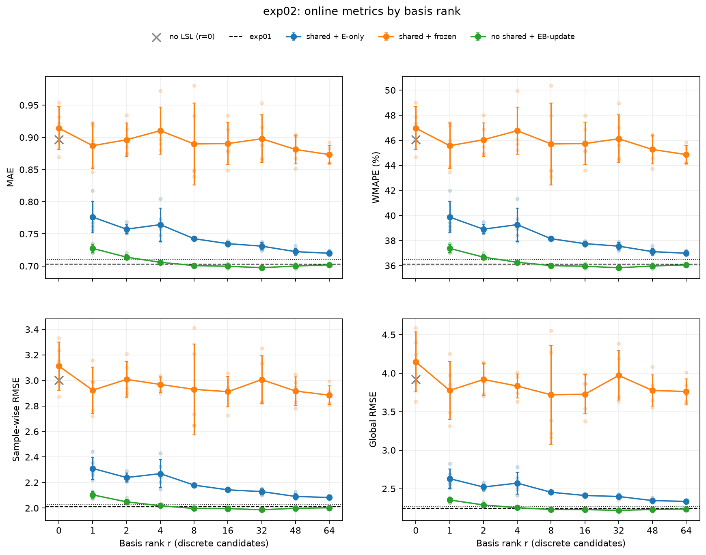
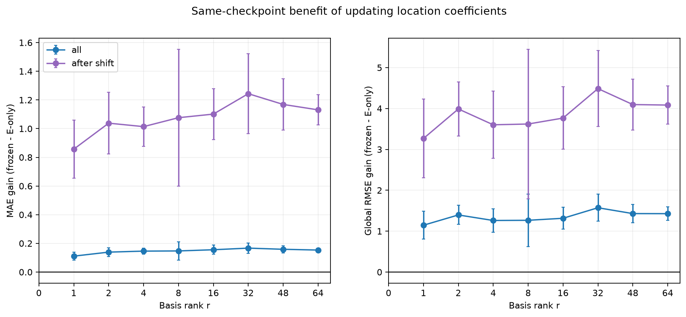
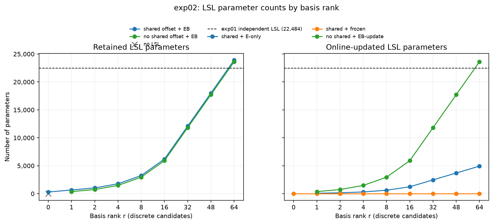
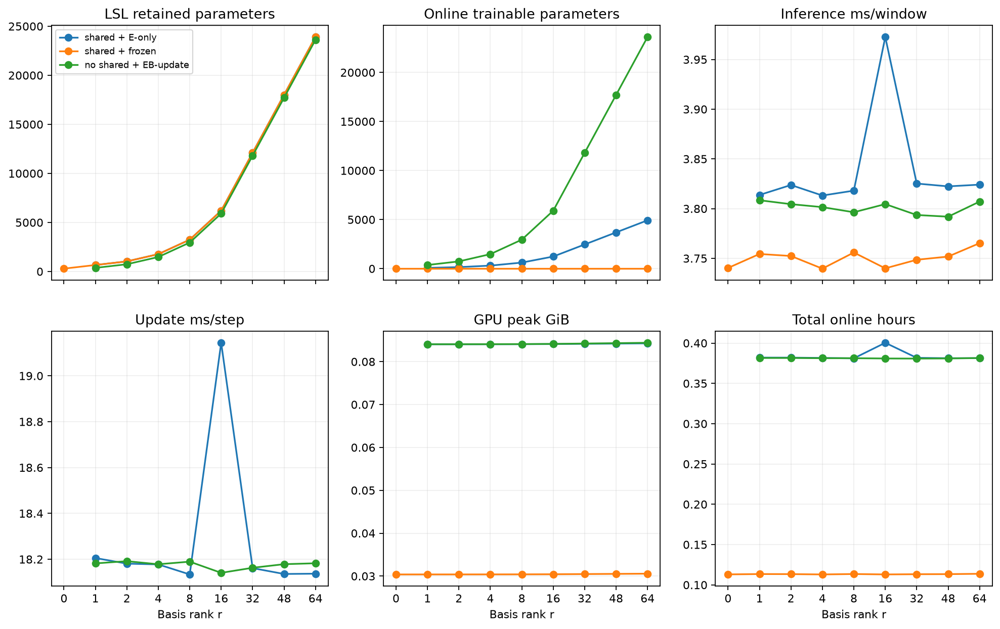
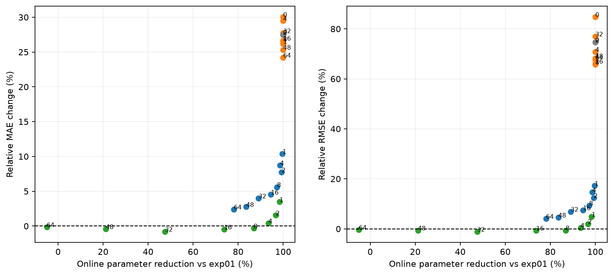
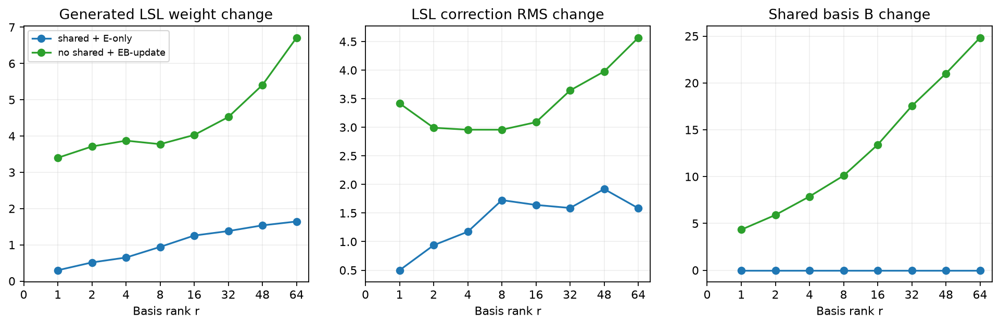
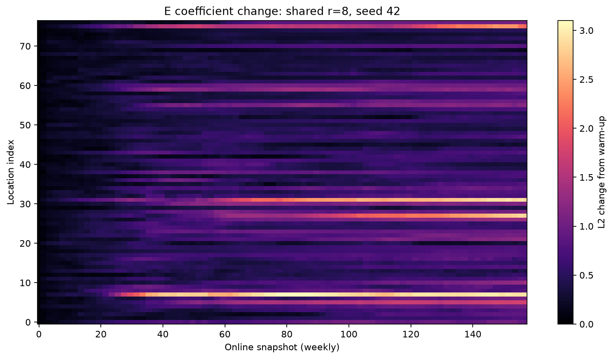

# exp02：NAPL型LSLのrank比較

## 実験概要

地点ごとに独立した`32→4→32`のLSLを持つexp01を基準に、77地点×292パラメータの地点別LSLを低ランク表現できるか検証した。LSL重み行列を、共通オフセットありの

$$
\Theta=\mathbf{1}\theta_{\mathrm{shared}}^\top+EB
$$

または共通オフセットなしの

$$
\Theta=EB
$$

で生成した。`E∈R^(77×r)`は地点係数、`B∈R^(r×292)`は全地点で共有する基底である。比較条件は次の3つ。

- **shared + E-only**：warm-up後は`E`だけをonline更新し、`θ_shared,B`を固定
- **shared + frozen**：E-onlyと同じwarm-up checkpointを使い、onlineでは更新しない
- **no shared + EB-update**：`θ_shared`を持たず、onlineで`E,B`を更新

rankは`{0,1,2,4,8,16,32,48,64}`、seedは`{42,43,44,45,46}`。Chicago-Tをtrain/validation/online=`20/5/75%`に分割し、入力・予測長12、Awake/Hibernate、SMB、12ステップの教師遅延などはexp01と同じ条件にした。共通LSLだけを持つrank 0と、LSLを完全に除いた対照も評価した。

## 基準と対照

exp01は77地点それぞれに独立したLSLを持ち、22,484個のLSLパラメータをonline更新する。exp02の判定基準は、これより少ない保持・更新パラメータでMAEとglobal RMSEの平均がexp01比1%を超えて悪化しないこととした。

|条件|MAE|WMAPE|sample-wise RMSE|global RMSE|
|---|---:|---:|---:|---:|
|exp01：独立LSL|0.7030±0.0038|36.115±0.197%|2.0090±0.0173|2.2439±0.0229|
|shared rank 0・frozen|0.9143±0.0331|46.968±1.702%|3.1124±0.1884|4.1466±0.3901|
|LSLなし・frozen|0.8965±0.0276|46.053±1.419%|3.0022±0.1365|3.9184±0.2809|

共通LSLを持つだけのrank 0とLSLなしは、ともにexp01より大幅に悪かった。したがって、今回の条件ではwarm-up済み予測器を固定して使うだけでは不十分で、地点別LSLのonline適応が主要な寄与を持つ。

## rank別の予測精度

### shared + E-only

|rank|MAE|WMAPE|sample-wise RMSE|global RMSE|online更新数|
|---:|---:|---:|---:|---:|---:|
|1|0.7761±0.0244|39.871±1.251%|2.3107±0.0873|2.6308±0.1271|77|
|2|0.7573±0.0072|38.904±0.369%|2.2392±0.0336|2.5218±0.0411|154|
|4|0.7644±0.0259|39.268±1.329%|2.2695±0.1101|2.5726±0.1411|308|
|8|0.7425±0.0013|38.144±0.068%|2.1799±0.0076|2.4535±0.0117|616|
|16|0.7348±0.0032|37.749±0.166%|2.1428±0.0110|2.4120±0.0183|1,232|
|32|0.7310±0.0057|37.551±0.293%|2.1290±0.0228|2.3988±0.0290|2,464|
|48|0.7224±0.0053|37.111±0.272%|2.0912±0.0226|2.3458±0.0287|3,696|
|64|**0.7199±0.0035**|**36.982±0.178%**|**2.0827±0.0137**|**2.3347±0.0157**|4,928|

rankを増やすと概ね改善し、E-only内ではrank 64が最良だった。ただしexp01に対してMAEが2.40%、global RMSEが4.05%悪く、事前に定めた1%基準を満たすrankはなかった。固定した基底`B`上の地点係数更新には効果があるが、今回の学習法では固定基底だけで独立LSLを完全には代替できなかった。

### no shared + EB-update

ここでの「no shared」は共通オフセット`θ_shared`がないという意味であり、基底`B`は地点間で共有する。

|rank|MAE|WMAPE|sample-wise RMSE|global RMSE|保持・online更新数|
|---:|---:|---:|---:|---:|---:|
|1|0.7275±0.0063|37.371±0.321%|2.1037±0.0264|2.3539±0.0325|369|
|2|0.7139±0.0041|36.672±0.209%|2.0488±0.0178|2.2891±0.0234|738|
|4|0.7059±0.0015|36.261±0.078%|2.0185±0.0086|2.2532±0.0095|1,476|
|8|0.7007±0.0015|35.997±0.075%|1.9969±0.0070|2.2305±0.0080|2,952|
|16|0.6997±0.0031|35.944±0.158%|1.9960±0.0133|2.2288±0.0169|5,904|
|32|**0.6974±0.0014**|**35.826±0.072%**|**1.9868±0.0072**|**2.2187±0.0078**|11,808|
|48|0.7001±0.0031|35.964±0.161%|1.9981±0.0127|2.2300±0.0161|17,712|
|64|0.7020±0.0018|36.061±0.093%|2.0026±0.0100|2.2360±0.0142|23,616|

rank 4はexp01比でMAEが0.40%、global RMSEが0.41%の悪化に収まり、**1%基準を満たした最小rank**だった。更新パラメータは22,484個から1,476個へ93.4%削減できた。

rank 8〜64は4指標すべてでexp01平均と同等以上だった。rank 32が全4指標の最良平均で、exp01に対してMAEを0.80%、sample-wise RMSEを1.10%、global RMSEを1.12%改善しながら、更新パラメータを11,808個へ47.5%削減した。rank 48、64では改善が続かなかったため、容量を増やせば単調に良くなる結果ではない。特にrank 64は独立LSLよりパラメータが多く、パラメータ効率化の成功例には含めない。

横軸は事前に固定したrank候補を等間隔に並べ、縦軸はMAE、WMAPE、sample-wise RMSE、global RMSEである。点はseed別、線とエラーバーは5 seed平均±標本標準偏差、黒破線はexp01平均、点線はexp01比1%悪化線を表す。横軸の表示間隔はrankの数値差を表さない。

## online更新の効果

shared条件では、各rankのE-onlyとfrozenを同じ最良warm-up checkpointから分岐した。下表の利得は`誤差(frozen)−誤差(E-only)`であり、正ならE更新が有利である。

|rank|MAE：全期間|MAE：変化後|global RMSE：全期間|global RMSE：変化後|
|---:|---:|---:|---:|---:|
|1|0.1110|0.8569|1.1454|3.2662|
|2|0.1389|1.0382|1.3966|3.9883|
|4|0.1460|1.0140|1.2609|3.6014|
|8|0.1472|1.0763|1.2660|3.6204|
|16|0.1556|1.1013|1.3152|3.7659|
|32|**0.1669**|**1.2437**|**1.5727**|**4.4864**|
|48|0.1587|1.1688|1.4298|4.0961|
|64|0.1534|1.1309|1.4277|4.0839|

全rank・両指標でE-onlyがfrozenを改善したため、低ランクな地点係数のonline更新自体は有効だった。変化後は、train統計で標準化した系列の直前2週を固定16次元RFFで比較し、train週ペアの90パーセンタイル`0.009961`を超えた地点×週を対象にした。157週×77地点のうち1,527件（12.63%）が該当し、この領域でも全rankで利得が正だった。ただし変化区間の抽出は需要変化との関連を示す診断であり、因果効果や他データへの一般化を証明するものではない。

## パラメータ数と計算コスト

代表的な条件をexp01と比較する。

|条件|保持数|online更新数|exp01比の更新削減率|推論時間|Awake更新時間|
|---|---:|---:|---:|---:|---:|
|exp01：独立LSL|22,484|22,484|—|—|—|
|shared E-only rank 8|3,244|616|97.3%|3.82 ms/window|18.13 ms/update|
|shared E-only rank 64|23,908|4,928|78.1%|3.82 ms/window|18.14 ms/update|
|no shared EB rank 4|1,476|1,476|93.4%|3.80 ms/window|18.18 ms/update|
|no shared EB rank 8|2,952|2,952|86.9%|3.80 ms/window|18.19 ms/update|
|no shared EB rank 32|11,808|11,808|47.5%|3.79 ms/window|18.16 ms/update|

左はモデルが保持するLSLパラメータ数、右はonlineで実際に更新するLSLパラメータ数である。黒破線はexp01の独立LSL 22,484個を表す。shared + frozenはLSLを保持するが、online更新数は0である。

推論時間はrank間で約3.8 ms/window、更新時間は約18.2 ms/updateでほぼ一定だった。LSLパラメータを減らしても、Graph WaveNetを含むforward/backwardやPython処理の比率が大きく、今回の実装では実行時間短縮に直結しなかった。`torch.cuda.max_memory_allocated`も更新条件では約86 MiBでほぼ一定だった。したがって本実験で確認できた効率化は、主に**保持・更新パラメータ数**であり、計算時間やGPUメモリの改善ではない。

## LSLの変化

週境界で`E`、`B`、生成された地点別LSL重み、固定参照特徴に対するLSL補正出力を記録した。E-onlyでは`θ_shared,B`が不変であること、EB-updateでは`B`も変化することを実行時に検証した。係数や重みの移動量だけを予測改善とはみなさず、上記の同一checkpointに対する予測誤差差と組み合わせて解釈する。

## 結論

1. **予測性能上、地点別LSLパラメータには強い冗長性がある。** `Θ=EB`をonline更新する条件では、rank 4、1,476パラメータでexp01比1%以内を満たした。これは独立LSLから93.4%の削減である。
2. **暫定的な精度最良点はrank 32だった。** 11,808パラメータで4指標すべてがexp01平均を上回った。ただしrank 8〜32の差は小さく、本実験は単一の最適rankを決定するものではない。
3. **地点係数のonline更新は有効だった。** E-onlyは全rankで同一checkpointのfrozenより改善し、データ変化が大きい地点×週でも利得が残った。
4. **固定基底だけではexp01に届かなかった。** E-onlyはrank 64でも1%基準を満たさず、基底を固定する制約、初期化、またはwarm-up方法に改善余地がある。
5. **可動基底は有望だが、効果の原因は分離できない。** E-onlyとEB-updateは`θ_shared`の有無、`B`の更新範囲、初期化、warm-up checkpointが異なる。この結果だけから「共通オフセットが不要」または「B更新だけが改善原因」とは断定しない。
6. **LSLのonline適応は必要だった。** LSLなしと共有LSL frozenは大きく悪化した。ただし、これらはonline更新も持たないため、LSL構造そのものと更新効果を完全には分離していない。

以上から、Chicago-Tでは、地点ごとに22,484個の独立パラメータを更新せずとも、共有される低次元構造で同等の予測を実現できることが示された。ただし、各rankモデルは独立にwarm-upしており、バックボーンが低ランクLSLを補償した可能性がある。したがって、これは**予測性能上の冗長性**を支持する結果であり、元LSLの292次元重みまたは補正関数そのもののrankを直接証明するものではない。

## 次の実験

- exp01の固定バックボーンとLSL補正出力を教師にした蒸留診断を実行し、元LSL関数を各rankでどこまで近似できるか確認する。
- `θ_shared`の有無を固定したまま`E-only`と`EB-update`を同一checkpointから分岐し、基底更新だけの効果を分離する。
- `32→4→32`を平坦な292次元ベクトルとして扱わず、down/up射影を層別に低ランク化する。
- 地点固有の4次元scale/shiftを高速更新し、共有MLPまたは共有基底を低速更新する二時間スケール適応を検証する。
- Chicago-T以外の時空間データでも、少数の地点係数と共有基底による適応が維持されるか評価する。
