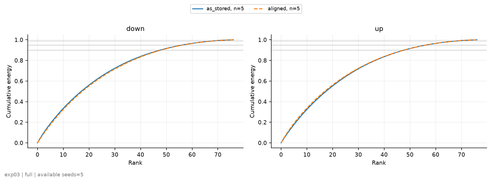
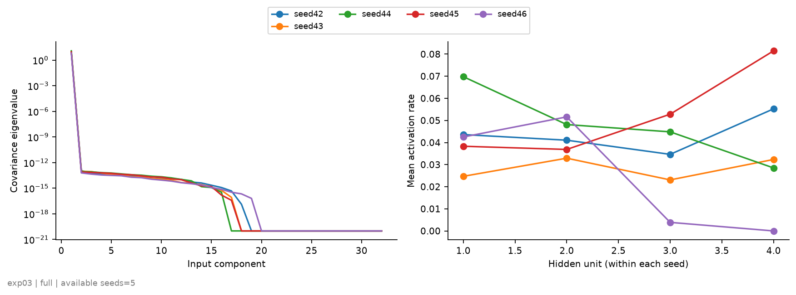
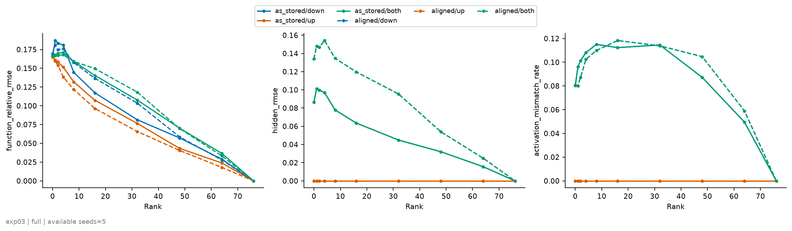
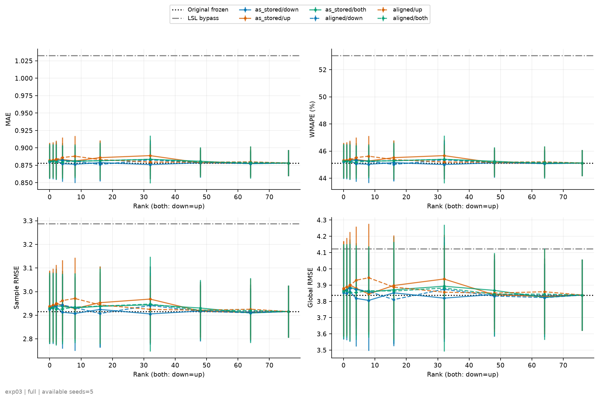
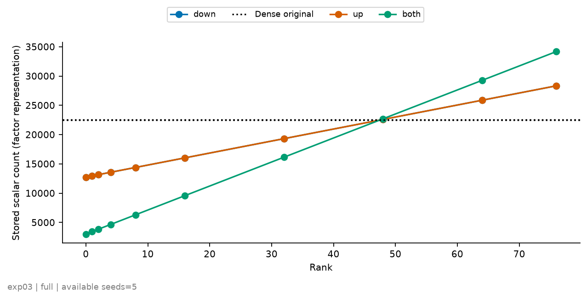
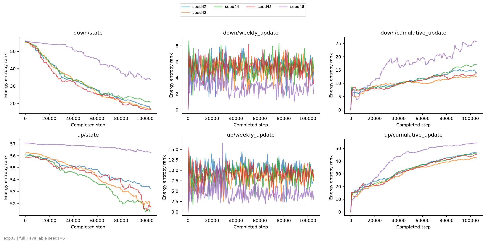
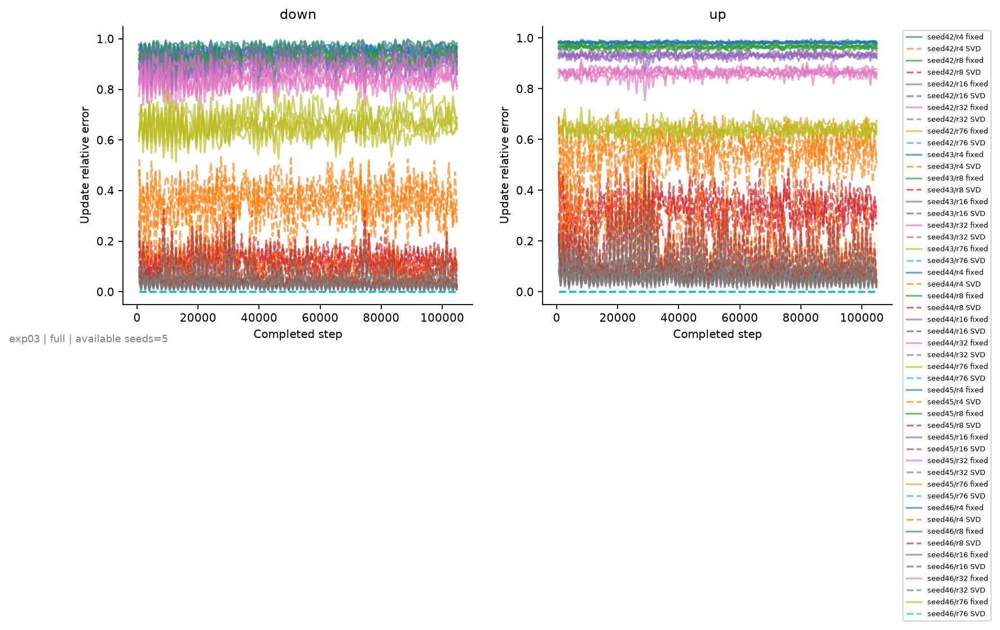

# exp03：層別SVDによる既存LSLの冗長性検証

## 実験概要

exp01で学習済みの地点別LSL（`32→4→32`、77地点）について、地点ごとの重みを少数の共有基底で近似しても、**再学習なしで**補正関数と予測を維持できるかを検証した。第1層 `W_d`（4×32）と第2層 `W_u`（32×4）をそれぞれ地点方向に並べた77×128行列とし、地点平均 `μ` を保存したうえで地点差を打ち切りSVDで近似した。

$$
\widehat X_\ell(r)=\mathbf{1}\mu_\ell^\top+U_{\ell,r}\Sigma_{\ell,r}V_{\ell,r}^\top,\qquad \ell\in\{d,u\}
$$

bias `b_d`（4次元）と `b_u`（32次元）は地点別のまま保持し、近似の対象にしない。したがってrank 0でも全地点が同じMLPにはならない。

- **実験A**：warm-up時点の重みの特異値スペクトル（as_stored、および隠れユニットのscale・置換を揃えたaligned）
- **実験B**：Down-only／Up-only／Both／Random projection／LSL bypassを同じcheckpointへ適用し、補正関数と予測の変化を測定
- **実験C**：exp01のonline適応を再実行し、週境界157時点の重みと更新差分のrank、warm-up基底への射影誤差、snapshotの圧縮耐性を測定

rankは`{0,1,2,4,8,16,32,48,64,76}`、seedは`{42,43,44,45,46}`。入力はexp01の最良warm-up checkpointで、近似後のfine-tuningや新しいwarm-upは行っていない。実行コードはcommit `80c247b`（未commit変更なし）、A〜Cとも全5 seedで完了した。

## 基準と対照

比較基準は、同じcheckpointを**更新なしで**評価したOriginal frozenである。exp01の適応あり集計値は低rank条件の基準にしない。

|区間|条件|MAE|WMAPE|sample-wise RMSE|global RMSE|
|---|---|---:|---:|---:|---:|
|validation|Original frozen|0.3862±0.0011|62.383±0.180%|0.9005±0.0049|0.9952±0.0065|
|validation|LSL bypass|0.6030±0.1487|97.403±24.018%|1.7135±0.6329|2.5643±1.1865|
|online|Original frozen|0.8783±0.0186|45.119±0.957%|2.9157±0.1102|3.8386±0.2183|
|online|LSL bypass|1.0327±0.0683|53.053±3.511%|3.2876±0.2400|4.1226±0.4918|
|online|（参考）exp01：online適応あり|0.7030±0.0038|36.115±0.197%|2.0090±0.0173|2.2439±0.0229|

LSL補正を0にするbypassは、同一seedの対応差でvalidationのMAEを平均56.1%、onlineのMAEを平均17.5%（seed別に+8.5%〜+23.7%）悪化させた。補正のRMSは入力特徴のRMSの0.49〜0.69倍あり、LSLの寄与が元から小さいケースには当たらない。ただしonlineのglobal RMSEはseed別に−6.8%〜+17.6%と符号が揃わず、更新なしのonline区間ではRMSE系の差は不安定である。bypassはbiasも0にするため、重みだけを除いた対照ではない。

## 実験A：重みの圧縮可能性

地点差のスペクトルは両層とも平坦で、少数の共有方向へは集中していなかった。

|表現|層|r90|r95|r99|effective rank|stable rank|E(4)|E(16)|E(32)|
|---|---|---:|---:|---:|---:|---:|---:|---:|---:|
|as_stored|down|48.2±0.4|56.6±0.5|69.0±0.0|55.6±0.3|23.3±1.3|15.5%|47.9%|75.0%|
|as_stored|up|48.2±0.4|56.8±0.8|69.2±0.4|56.3±0.5|25.0±1.2|14.5%|47.0%|74.6%|
|aligned|down|48.2±0.4|57.2±0.4|69.0±0.0|56.4±0.4|25.9±1.0|14.4%|47.0%|74.4%|
|aligned|up|48.2±0.4|56.8±0.4|69.2±0.4|55.6±0.8|23.0±2.6|15.7%|48.0%|74.9%|
|（参考）独立同分布の乱数行列|—|48.4|57.0|69.2|56.5|25.4|14.5%|46.8%|74.3%|

rankの上限は76である。energyを90%保存するのに48、99%に69が必要で、相対Frobenius誤差はr=4で0.92、r=16で0.72〜0.73、r=32で0.50、r=48で0.31、r=64で0.15だった。E(r)は地点別パラメータ差の累積energyであり、入力データの分散説明率ではない。

- **乱数行列と区別できない。** 最下行は、同じ77×128の一様乱数行列を200回生成して同じ手順で求めた参考値（report作成時の追加計算）で、5 seedの実測はすべての指標でこれとほぼ一致した。Frobeniusノルムも down 10.06、up 27.85 と、Conv1dの既定初期化から期待される値（10.13、28.66）に近い。
- **地点平均はほとんど寄与しない。** 平均成分が全energyに占める割合は down 2.4%、up 1.3% にとどまる。
- **整列しても変わらない。** alignedの関数同値性は全seedで確認でき（最大絶対誤差2×10⁻⁶未満、未scaleユニット0件）、スペクトルはas_storedと同じだった。低rank性がユニットの置換・scaleの任意性に隠れていたわけではない。
- **各MLP内の線形写像も低rankではない。** 地点別の4×32・32×4行列をrank 1/2/3で近似した相対誤差の地点中央値は、約0.80/0.60/0.38〜0.39だった。

SVDの数値検証として、rank 0・4・76の実測再構成誤差はEYMの末尾誤差と一致し、rank 76は元重みを再現した。

横軸は地点差のrank、縦軸は累積energy。線は5 seed平均、帯はseed間の最小〜最大、灰色の横線は90/95/99%を表す。特異値そのものは`figures/singular_spectrum_by_layer.png`、相対Frobenius誤差は`figures/rank_vs_weight_error.png`にある。

## LSL内部の利用状況

train参照1,024窓での構造診断から、重みのrankとは別に、次の2点が確認できた。

|診断|5 seedの値|
|---|---|
|入力特徴の共分散固有値|第1固有値6.7〜12.2、第2固有値は1.2×10⁻¹³以下|
|発火率が0.1%未満の隠れユニット（地点×ユニット308個中）|88.6〜94.8%（平均91.1%）|
|4ユニットすべてが非発火の地点（77地点中）|53〜66地点（平均58地点）|
|隠れユニットの平均発火率|2.5〜5.2%|
|LSL補正のRMS（validation）／`b_u`のRMS|0.306〜0.322／0.301〜0.311|

1. **LSLへの入力は実質1次元である。** 中心化した32次元特徴のrankは数値的に1で、strategyで導いた構造上の性質（`h=a x+c`）を実測でも確認した。入力射影を合成した第1層出力も直接計算と一致した（最大絶対誤差8.4×10⁻⁶以下）。
2. **隠れユニットの約9割は発火していない。** 全ユニットが非発火の地点では補正は `f_n(h)=b_{u,n}` となり、入力に依存しない地点別の定数ベクトルになる。補正のRMSが`b_u`のRMSとほぼ等しいことも、補正の大半が出力biasであることと整合する。

つまりwarm-up時点のLSLは、多くの地点で「地点別の32次元オフセット」として働いており、重み行列 `W_d,W_u` が補正に関与しているのは一部の地点・ユニットに限られる。低発火率は中間幅を削減できる候補を示すにとどまり、幅を縮小した後の機能評価は行っていない。

左は入力特徴の共分散固有値（対数軸）、右はユニット番号ごとの平均発火率（77地点平均）。ユニット番号はseed間で対応しない。

## 実験B：再学習なしの関数・予測介入

### rank別の結果（Both、as_stored）

補正相対誤差は `‖f̂−f‖_F/‖f‖_F`、予測の差は同じseedのOriginal frozenに対する相対差である。保持数は因子表現で保存する数値の個数で、元LSLは22,484個。

|r_d=r_u|保持数|重み相対誤差|補正相対誤差：val|補正相対誤差：online|MAE差：val 平均（最悪seed）|MAE差：online 平均（最悪seed）|global RMSE差：online 平均（最悪seed）|
|---:|---:|---:|---:|---:|---:|---:|---:|
|0|3,028|1.00|0.131|0.167|+0.39%（+0.92%）|+0.32%（+1.24%）|+0.69%（+3.19%）|
|4|4,668|0.92|0.131|0.171|+0.42%（+1.08%）|+0.40%（+1.78%）|+0.87%（+4.67%）|
|8|6,308|0.85|0.125|0.159|+0.39%（+1.06%）|+0.29%（+1.63%）|+0.46%（+3.86%）|
|16|9,588|0.72|0.114|0.140|+0.44%（+1.29%）|+0.36%（+2.10%）|+0.74%（+5.35%）|
|32|16,148|0.50|0.086|0.108|+0.34%（+0.52%）|+0.59%（+1.62%）|+1.36%（+3.81%）|
|48|22,708|0.31|0.055|0.070|+0.14%（+0.37%）|+0.30%（+1.00%）|+0.81%（+3.08%）|
|64|29,268|0.15|0.027|0.037|+0.06%（+0.15%）|−0.11%（+0.02%）|−0.37%（+0.13%）|
|76|34,188|0.00|0.000|0.000|0（完全再構成）|0|0|

- **rank 0でも補正の誤差は13〜17%にとどまった。** 地点別の重みをすべて地点平均へ置き換えても（重み相対誤差100%）、補正関数の大半は残った。これは前節のとおり補正の主成分が保持したbiasであるためで、重みが低rankだからではない。rank 0の誤差は一部の地点に集中しており、地点別の補正相対誤差は中央値0.0003、90パーセンタイル0.16、最大0.63だった（online特徴、5 seed平均）。
- **rankを上げても誤差はゆっくりとしか減らない。** r=4はrank 0と同等で、補正相対誤差が5%付近まで下がるのはr=48以降だった。この時点で保持数は元LSLを超える。
- **予測は鈍感だが、seedごとに符号が揃わない。** onlineのMAE差は平均+0.3〜+0.6%と小さい一方、rank 0でもseed別に−0.76%〜+1.24%とばらついた。rankに対して単調でもなく、平均値の小ささを「機能を保った」証拠とはみなさない。

左から補正相対誤差、hidden出力のRMSE、ReLU activationの不一致率（online特徴、5 seed平均）。実線がas_stored、破線がaligned。Up-onlyは第1層を変えないため、中央と右は0になる。

### 層別の介入とrandom projection

|r|Down-only：補正相対誤差|Down-only：MAE差|Up-only：補正相対誤差|Up-only：MAE差|
|---:|---:|---:|---:|---:|
|0|0.168|+0.16%|0.165|+0.43%|
|4|0.181|−0.12%|0.152|+0.57%|
|8|0.145|−0.22%|0.132|+0.32%|
|16|0.117|+0.04%|0.107|+0.88%|
|32|0.081|−0.26%|0.077|+1.20%|
|48|0.057|+0.04%|0.043|+0.04%|
|64|0.029|−0.03%|0.024|−0.05%|

値はonline・as_stored・5 seed平均。片層だけをrank 0にしても、補正相対誤差は両層をrank 0にした場合（0.167）と同じだった。2層は直列なので、どちらか一方の地点差を失うと地点別の重み経路全体が失われる。Down-onlyではr≤48でReLUの符号不一致が8〜12%生じた（元preactivationが0近傍の割合は0.05%以下）。Up-onlyのr=32はMAEが+1.20%（最悪seed +2.99%）とrank 0より悪く、重み誤差の小ささと予測誤差の小ささは対応しなかった。

|r|SVD：補正相対誤差|Random：補正相対誤差|SVD：MAE差|Random：MAE差|
|---:|---:|---:|---:|---:|
|4|0.171|0.167|+0.40%|+0.32%|
|8|0.159|0.167|+0.29%|+0.31%|
|16|0.140|0.167|+0.36%|+0.31%|
|32|0.108|0.168|+0.59%|+0.30%|

値はonline・Both・as_storedで、Randomは固定projection seed 3通りの平均。random部分空間はrank 0からまったく改善せず、SVDの主要方向はr≥8で補正誤差を下げた。ただしr=4では差がなく、予測のMAE差ではSVDとrandomを区別できなかった。

alignedでも同じ傾向で（Both・onlineの補正相対誤差はr=0で0.167、r=32で0.118、r=64で0.033）、整列による改善はなかった。

横軸はrank（Bothは`r_d=r_u`）、縦軸はonline区間・更新なしの4指標。点とエラーバーは5 seed平均±標本標準偏差、黒点線はOriginal frozen、灰色一点鎖線はLSL bypass。エラーバーの大半はcheckpoint間の差で、条件間の対応差ではない。validationの`r_d×r_u`全組合せは`figures/rank_grid_metrics.png`にある。

### 事前に定めた判定

「保持数が元LSL未満で、MAE・global/sample RMSEの悪化が各1%以内、かつ補正相対誤差が5%以内」を満たしたseed数を数えた。

|区間|表現|保持数が元未満の組合せ数|予測1%以内を全5 seedで達成|補正5%以内を全5 seedで達成|両方を達成したseed数の最大|
|---|---|---:|---:|---:|---:|
|validation|as_stored|87|4組|0組|1/5|
|validation|aligned|87|2組|0組|1/5|
|online|as_stored|7|0組（最大3/5）|0組|0/5|
|online|aligned|7|0組（最大3/5）|0組|0/5|

**基準を全seedで満たすBoth条件はなかった。** validationで予測1%以内を全seedで満たしたのは `(r_d,r_u)=(16,64),(32,32),(32,48),(48,32)` だが、いずれも補正相対誤差は平均7〜10%で5%を超えた。補正を5%以内に収めるにはr≈48以上が必要で、因子表現の保持数は元の22,484個を上回る。片層だけの介入でも、最大はUp-only r=32（aligned、validation）の3/5 seedだった。したがって、地点方向の層別SVDで「元より少ない保持数で補正関数を保つ」ことはできなかった。

Bothの保持数は `3028+205(r_d+r_u)` で、同rankではr≤47が元未満になる。評価はdenseに再構成して行ったため、これは保存可能な数値の個数であり、実測メモリや計算時間の削減ではない。

## 実験C：既存online軌跡での冗長性

### exp01との照合

Originalのonline適応を全5 seedで再実行し、4指標・処理窓数105,181・更新回数52,765がexp01と一致した。重みはonline開始前と672窓ごとの境界で計157時点を保存した。Hibernate週の区間にも境界の1回だけ更新が入るため、更新ゼロの区間はなかった。以下では更新回数671〜672回の区間をAwake週（各seed 78区間）、1回の区間をHibernate週として分けて集計する。

### 状態のrank推移

|層|指標|開始前|52週|104週|156週|
|---|---|---:|---:|---:|---:|
|down|effective rank|55.6|38.1|28.0|21.0|
|down|r90|48.2|42.0|37.2|31.4|
|down|中心化ノルム|9.94|10.40|10.21|10.16|
|up|effective rank|56.3|55.4|54.4|52.9|
|up|r90|48.2|47.8|47.4|46.8|
|up|中心化ノルム|27.67|24.02|20.73|17.98|

値は5 seed平均。第1層はonline適応とともに少数の方向が大きくなり、effective rankが55.6から21.0へ下がった（seed 46だけは33.8で低下が遅い）。それでも156週時点の相対Frobenius誤差はr=4で0.66、r=32で0.31あり、強い低rankではない。第2層はスペクトルの形をほぼ保ったままノルムだけが縮小した。

### 週更新のrankと固定基底

|層|effective rank|r90|r99|その週のSVD：r=4|r=8|r=16|r=32|warm-up固定基底：r=4|r=8|r=16|r=32|r=76|
|---|---:|---:|---:|---:|---:|---:|---:|---:|---:|---:|---:|---:|
|down|5.3±1.0|5.1±0.9|13.5±6.0|0.354|0.159|0.071|0.048|0.948|0.925|0.892|0.830|0.636|
|up|9.0±1.8|9.0±1.2|24.7±11.9|0.524|0.340|0.133|0.087|0.982|0.964|0.929|0.858|0.629|
|（参考）無作為なr次元部分空間の期待値|—|—|—|—|—|—|—|0.984|0.968|0.935|0.866|0.637|

Awake週の週更新についての値（各seed 78区間の平均を5 seedで平均、±はseed間の標本標準偏差）。SVDと固定基底の列は、中心化した更新に対する相対Frobenius誤差である。Hibernate週の区間は更新ノルムが約0.005（Awake週は down 0.71、up 1.09）と小さく、effective rankは down 4.3、up 7.2 だった。

- **1週分の更新は低rankである。** 第1層はr=8、第2層はr=16で、その週の更新のenergyの97%以上を表せた。
- **warm-up時点の基底はその更新を表せない。** `V_r(0)`への射影誤差は、無作為な部分空間の期待値 `√(1−r/128)` とほぼ同じで、r=76まで使っても誤差は0.63〜0.64残った。第1層だけがわずかに期待値を下回る。warm-up重みのSVD基底を固定して係数だけを更新する方式は、今回観測した更新方向をほとんど含まない。
- **累積更新は時間とともに高rankになる。** 開始前からの累積更新のeffective rankは、156週時点で down 16.6、up 47.1 だった。各週の更新が低rankでも、方向が週ごとに変わるため、積み上がった変化は低rankに収まらない。

上段が第1層、下段が第2層。左から状態、週更新、累積更新のeffective rankで、線はseed別。週更新はAwake週とHibernate週の区間を交互に含む。

実線がwarm-up固定基底への射影誤差、破線がその週の更新に対する最適なSVD誤差。同じrankでも両者は大きく離れている。

### snapshotの圧縮耐性

各snapshotをcloneして低rank化し、同じtrain参照窓で補正相対誤差を測った（as_stored、5 seed平均）。

|条件|r|開始前|52週|156週|
|---|---:|---:|---:|---:|
|Down-only|4|0.221|0.311|0.316|
|Down-only|16|0.133|0.094|0.049|
|Down-only|32|0.082|0.048|0.022|
|Up-only|4|0.155|0.582|0.533|
|Up-only|16|0.110|0.388|0.255|
|Up-only|32|0.078|0.223|0.140|
|Both|4|0.183|0.605|0.565|
|Both|16|0.150|0.401|0.266|
|Both|32|0.108|0.231|0.143|

online適応が進むと、第1層はr≥16で圧縮しやすくなり、第2層は圧縮しにくくなった。Bothのr=4では補正相対誤差が0.18から0.57へ増え、warm-up時点より地点別の重みが補正に効くようになっている。同じ参照窓での補正のRMSも0.31から0.61へ増えた。156週時点のseed間差は大きい（Both・r=4で0.17〜0.83）。これは軌跡上のモデルを事後に圧縮した診断であり、低rankモデルを継続更新したonline性能ではない。参照窓は過去のtrain区間なので、適応後snapshotの予測4指標はここでは解釈しない。

### 補足：保存済みsnapshotからの追加確認

report作成時に、保存した週別重み（`seeds/seed*/trajectory/arrays/`）から次を追加計算した。`metrics.json`には含まれない。

|確認項目|down|up|
|---|---:|---:|
|ユニット別重みノルムの最終/初期比（中央値）|0.592|0.592|
|初期方向とのcosineが0.99を超えるユニットの割合|80.0%|89.2%|
|Awake週の更新energyの90%を占める地点数（77地点中）|8.1|10.6|
|累積更新のenergyの90%を占める地点数|41.6|64.4|

- **大半の重みはonlineで学習されていない。** ノルム比0.592は、AdamW（lr 0.001、weight decay 0.01）の縮小だけを52,417回受けた場合の `(1−10⁻⁵)^52417=0.592` と一致する。8〜9割のユニットは方向を変えずに縮んだだけで、非発火のため勾配を受けていないとみられる。第2層のノルム縮小とスペクトル形状の維持もこれで説明がつく。
- **週更新の低rank性は、更新が少数の地点に集中した結果でもある。** Awake週の更新energyの90%は8〜11地点に集中していた。行が数本しか動かない行列は自動的に低rankになるため、週更新のrankの低さを「多くの地点が共有方向へ動いた」と読むことはできない。
- **`b_u`は大きく動いた。** online前後の`b_u`の変化のRMSは0.24〜0.30で、初期値のRMS（約0.31）と同程度だった。今回のSVDが対象にしなかったbiasが、補正と適応の両方で大きな役割を持つ。

## 結論

1. **既存LSLの重みに、地点間で共有される低rank構造は見つからなかった。** warm-up時点の77×128行列は両層ともenergy 90%にrank 48、99%にrank 69を要し、スペクトルは乱数行列と区別できなかった。隠れユニットを整列しても変わらない。
2. **層別SVDでは、元より少ない保持数で補正関数を保てなかった。** 補正相対誤差5%以内にはr≈48以上が必要で、保持数は元の22,484個を超える。事前に定めた基準を全seedで満たすBoth条件はなく、最大でも1/5 seedだった。
3. **予測は地点別の重みに鈍感だった。** rank 0（保持数3,028個、元の13.5%）でもMAEの悪化は平均+0.3〜+0.4%、最悪seedでvalidation +0.92%・online +1.24%だった。ただし理由は重みの低rank性ではなく、補正の大半が地点別biasで決まることにある。
4. **warm-up時点のLSLは、主に地点別の定数オフセットとして働いている。** 隠れユニットの約91%が非発火で、LSLへの入力も実質1次元だった。LSLを外すとMAEは17.5%（online）悪化するため補正自体は必要だが、その中身の多くは`b_u`である。
5. **online更新は週単位では低rankだが、固定基底には載らない。** 週更新はrank 8〜16でほぼ表せる一方、warm-up基底への射影誤差は無作為な部分空間と同程度だった。更新は少数の地点に集中しており、累積すると高rankになる。
6. **online適応後は、重みの寄与が増える。** 適応後snapshotでは同じrankでの補正誤差が大きくなり、特に第2層の圧縮が難しくなった。warm-up時点の圧縮可能性を適応後へそのまま当てはめることはできない。

以上から、exp02で得た「少ないパラメータで同等の予測ができる」という結果は、**既存LSLの重みが少数の共有基底で書ける**ことを意味しない。今回の範囲で確認できた冗長性は、重みの多くが非発火ユニットに属して補正に関与していないこと、つまり**使われていないパラメータの多さ**であり、地点方向の低rank性ではない。exp02の低rankモデルは別々にwarm-upしているため、元LSLを近似したのではなく、別の解を学習したと解釈するのが妥当である。

### 限界

- Chicago-T・5 seed・exp01のcheckpointに限った結果で、他データやDOL全体へは一般化しない。
- 近似対象は重みだけで、補正の大半を担うbias（77地点×36個＝2,772個）は保持したまま分析していない。
- 更新なしのonline評価はcheckpoint間の差が大きく、条件間の対応差はseedで符号が変わる。1%／5%は暫定的な許容幅で、統計的な同等性の検証ではない。
- 関数診断は各split最大1,024窓、snapshotの診断はtrain参照窓に基づく。発火率はwarm-up時点のtrain特徴でのみ測っており、online中の発火率は直接測っていない。
- 低rankモデルを継続してonline更新する実験は行っていない。固定基底やrank rの更新で十分かどうかは、この結果からは結論できない。
- 乱数行列との比較と前節の補足は、report作成時の追加計算である。

## 次の実験

- 重みを共有または削除し、地点別の`b_u`（および`b_d`）だけを残したLSLを、同じcheckpointからの介入とonline適応の両方で評価する。bias-onlyでexp01にどこまで近づくかが、今回の解釈の直接の検証になる。
- 非発火ユニットを削除して中間幅を4から1〜3へ縮小し、補正関数と予測の変化を測る。あわせてonline中の発火率を週ごとに記録する。
- 非発火の原因（初期化、Dropout 0.5、入力が1次元であること）を切り分け、ユニットが発火する設定でwarm-upした場合に重みのスペクトルが変わるかを確認する。
- 週更新が集中する地点を特定し、入力分布の変化（`trajectory/shift_and_error.json`）や後続の予測誤差との関係を調べる。
- 固定基底ではなく、基底も更新する低rank表現（exp02のEB-update）で、週ごとに回転する更新方向へ追従できるかを同一checkpointから検証する。
